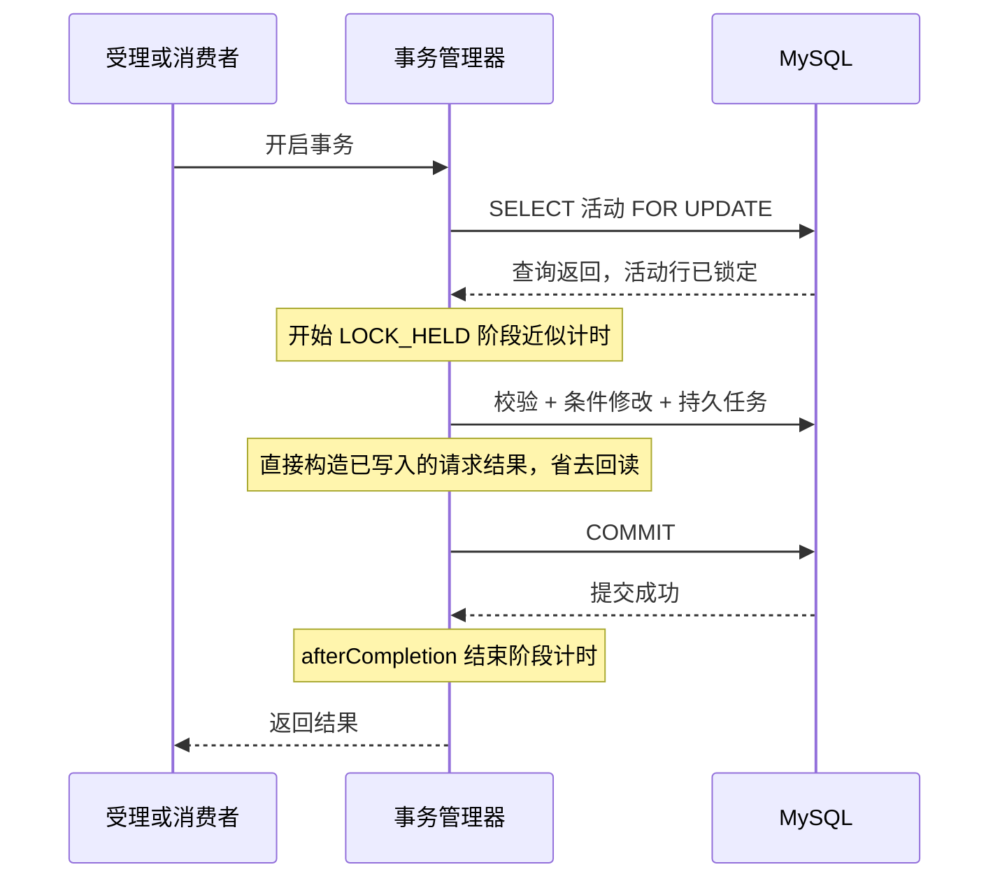

# 热点事务优化与长稳验收

本轮沿用 `/v2` 独立后端、MySQL + Redis + Kafka 链路。目标是减少热点活动锁内的无效数据库往返、控制对账每轮工作量，并补充固定历史数据量对照和 15 分钟持续验收。没有改变一人一单、库存守恒、请求终态、恢复 epoch 或事务提交失败的处理规则。

## 事务中的变化

| 路径 | 原实现 | 优化后 | 保留的正确性约束 |
|---|---|---|---|
| 新请求持久受理 | 插入请求与 Outbox 后，再 SELECT 请求作为返回值 | 用本事务已写入的字段构造返回值，事务提交成功后才返回调用方 | 同一活动行锁、用户/请求键唯一约束、epoch 校验、数据库时间判断 |
| 建单请求完成 | UPDATE 终态并写补偿动作后，再 SELECT 同一请求 | 仅在 UPDATE 确实修改一行时构造对应终态；未修改时仍重新读取 | 条件状态转换、订单唯一约束、条件扣库存、补偿同事务 |
| 消费者提交后 | 再 SELECT reason 判断是否写售罄提示 | 使用建单事务已经返回的 reason | 数据库事务完成后才 ack；售罄提示失败不影响确认 |

正常异步成功链路的 Trading / 消费者 SQL 调用由逻辑上的 18 次降为 15 次，其中锁内结果回读减少两次，锁外回读减少一次。不包含 Redis、准入检查、发布器、事务 begin/commit 和后台维护 SQL；实际阶段计数还可能包含重放与维护访问，不能把它当数据库全局语句总数。

`upgrade.compact-transactions=false` 保留对照路径，默认 `true`。两条路径使用同一个新二进制、同样的阶段计时和后台配置做交替实验，避免把观测代码开销或对账修改混入事务优化差异。该项事务回读优化的回滚只需切换该参数，不涉及数据库迁移。



`ACCEPT_LOCK_HELD` 和 `ORDER_LOCK_HELD` 从 FOR UPDATE 查询返回后开始，到事务 afterCompletion 回调结束。它们覆盖后续 SQL 和提交，但不包含数据库拿到锁至查询结果返回客户端之间的网络时间，因此是持锁阶段近似观测，不是 MySQL 原生精确锁时间。回滚和重试也分别记录尝试。

SQL 子阶段增加数据库时钟、请求读取、epoch 检查、请求/Outbox 插入、事件匹配、重复订单检查、库存扣减、建单、请求完成、补偿动作插入与旧消费后置读取。均采用固定枚举，无用户/订单维度。原 FOR UPDATE 查询总耗时仍保留，外部 MySQL 采样同时记录等待关系数量和去重后的等待事务数。

## 对账的有界扫描

旧任务每轮读取全部 `ux_reservation_epoch`，再逐活动访问 Redis。现在使用主键游标：

```sql
SELECT activity_id FROM ux_reservation_epoch
WHERE activity_id > ? ORDER BY activity_id LIMIT ?;
```

默认每轮最多访问 32 个活动、裁定 100 个到期预占，每活动最多取 100 个。只推进实际访问过的活动；达到动作预算后，下轮继续后续活动。游标到尾部后回到 0，重启后也从 0 开始，不依赖内存游标保障持久正确性。数据库请求、终态墓碑和 Redis epoch 仍决定裁决结果。

分页不会保证历史活动数量无限增长时每个活动的探测延迟不变：单轮工作量有界，但完整一轮需要更多调度周期。`repair.scannedActivities`、`completedSweeps` 和 `RECONCILE_ACTIVITY` / `RECONCILE_CYCLE` 可用于观察进度。一次同步 SQL 或 Redis 调用仍可能耗时较长，100 条是工作量预算，不是硬实时期限。现有持久化补偿 drainActions 独立运行，不必等待历史活动遍历完毕。

管理接口 `/admin/status` 的全局 Redis 预占盘点仍是全量操作，仅用于低频验收；持续采样使用 `/admin/pipeline`，不对全体活动逐一请求 Redis。数据继续扩大时，应进一步设计持久化活跃活动索引与关闭协议，不能只把 LIMIT 调得更大。

### 补偿查询的索引匹配

本机 MySQL 8.4.11 的 EXPLAIN 输出显示，原补偿查询虽然 LIMIT 100，但 `ORDER BY a.created_at,a.id` 仍出现 a 表 ALL 扫描与 filesort。修改为 `ORDER BY a.next_at,a.id` 后，候选计划使用已有 `ux_reservation_action_ready(applied_at,next_at)` 索引的 range 扫描，并消除 filesort，无需增加索引或迁移。

证据：[原查询计划](../evidence/hotspot-final-20261003/query-plans.txt)、[候选查询与索引计划](../evidence/hotspot-final-20261003/repair-index-candidate-plan.txt)。这是该数据分布下的优化器计划，不是 EXPLAIN ANALYZE 的实际行数或耗时；query_cost 也不是毫秒。不保证所有未来分布都固定采用同一计划。延期重试按下一次到期时间参与排序；未来任务仍被 next_at 条件排除。数据库返回的到期动作仍受 repairBatch 限制。

排序可能让 RESTORE 先于被延期的 CONFIRM 执行，因此还验证了先回补后确认不能再次消耗库存。Lua 对 RESTORED 状态的晚到确认保持幂等，业务状态转换不依赖补偿消息严格按创建顺序执行。

## 数据保留与清理策略

本轮没有启动生产历史数据自动删除。原因是各表还参与幂等、重放和恢复判断，不能按“发送成功”就独立删掉 Outbox。

| 数据 | 当前保留规则 | 后续可执行清理的前置条件 |
|---|---|---|
| 请求与订单、用户/请求键关系 | 保留业务事实及终态，不设置自动删除期 | 先明确幂等键有效期与业务留存要求；归档后查询和幂等判断仍需识别旧键 |
| Outbox | 未发送、带租约或仍可能重放的记录必须保留；已发送元数据也保留 | 消费者会检查 eventId/requestId/activityId 关联，归档后必须保留可校验的事件索引，且覆盖消息保留期与人工重放窗口 |
| 补偿动作 | 未应用动作不删除；已应用动作当前保留审计 | 活动关闭、请求终态、订单无待确认、动作已应用；先归档并核验，再按主键小批量删除，失败可重复执行 |
| Redis 预占状态 | 不因活动过期就直接删除 | 确认没有待受理、待确认、补偿与孤儿预占，并定义旧请求重放的数据库回退行为后，才能按活动释放 |
| 缓存失效任务 | 成功处理后按 generation 条件删除 | 已由现有实现保障，失败继续重试 |

不能凭空设置“30 天后清理”并声称符合业务留存要求。本轮实验清理仅限脚本自己创建、记录到 owned-fixtures.json 且完成验收的合成活动：先排空补偿与 Kafka，停止自身 JVM，再按该活动 ID 删除测试行和明确的 Redis 键；没有 TRUNCATE、FLUSHDB，也没有删除此前项目数据。失败实验保留数据与失败文件供排查。

## 实验设计

### 固定历史数据量对照

每组先预热 50 单，再测 500 单、HTTP 并发 8、单热点。旧路径和精简路径交替执行三轮，Outbox batch=100、window=1，分页对账配置相同。每次测量后先保存原始请求、阶段快照和锁采样，确认消费完成，再清理本次合成活动。比较六张核心表的历史行数，清理后的数量必须与本次开始前相等。

这固定的是逻辑历史数据量，没有重建 MySQL 数据文件或清空缓冲池；物理页布局、操作系统缓存和宿主机资源仍可能变化。采用交替顺序和重复轮次降低偏差，不宣称严格统计显著性。

### 15 分钟单热点验收

按独立到达时间每 25 ms 发一个请求，计划 900 秒 × 40/s = 36,000 次，另有测量前 50 单预热。在途上限 64，超过上限的计划到达单独计数；所有 HTTP 拒绝和传输错误都保留。每 5 秒采集队列、堆占用、GC 次数、分页进度，结束后保存完整轨迹；运行中另每约 30 秒写入进度快照，每分钟计算 HTTP 与业务完成延迟。

订单仍按原业务规则在 5 分钟后过期，测试不绕过该规则，也不把“请求成功建单”混同于“订单一直处于已确认状态”。因此后 10 分钟包含持续建单和旧订单过期、释放库存、补偿的共同负载。

completed_at 是事务内部写入的业务完成时间近似；排空指标则以已提交状态查询确认。15 分钟可以观察这段负载下的趋势，不能证明不存在内存泄漏、无限时间稳定或达到生产容量。

首次 15 分钟轮次在收集终态时触发 Node 同步命令输出缓冲上限（ENOBUFS），没有生成完整逐请求延迟报告，不能计为长稳验收通过。已保留 [失败记录](../evidence/hotspot-long-1790958036429/failure.json)、[补查说明](../evidence/hotspot-long-1790958036429/recovered-database-summary.json) 和同目录数据库终态 TSV：包含 50 单预热在内，35,995 条 SUCCEEDED、55 条 EXPIRED。不能从这些数据库记录倒推出已经丢失的 HTTP 状态和延迟分布。

修复后的采集脚本先保存原始样本，再按主键每页读取 500 条数据库终态；finally 还会保存可用样本。前一轮合成活动在数据库终态归档、库存关系及未完成任务核对、Kafka 三分区 lag=0 后单独清理，避免污染重跑。修复后重新运行完整 15 分钟，不拼接两次运行的指标。

### 中间版本证据（补偿排序修改前）

[固定行数对照](../evidence/hotspot-controlled-1790960150135/summary.json) 共 6 组、3,000 个测量请求全部成功，每组另有 50 单预热。六张核心表清理后的历史行数与各组开始前一致。旧路径/精简路径的建单完成时间近似 TPS 中位数分别为 98.39 / 102.63；HTTP P95 为 51.21 / 42.82 ms；业务完成 P95 为 2772 / 2659 ms。受理持锁阶段均值的三轮中位数从约 3.99 ms 降至 3.58 ms，建单持锁阶段从约 3.75 ms 降至 3.67 ms，收益有限。

[完整 15 分钟中间版本验收](../evidence/hotspot-long-1790959183759/summary.json)：36,000 个测量请求全部 202 后成功建单，无生成器跳过，HTTP P95 10.72 ms，业务完成 P95 113 ms。前 5 分钟各分钟业务完成 P95 中位数 112 ms，后 5 分钟 114 ms。该二进制尚未包含随后发现的补偿排序修正，不能代替最终版本验收。

### 最终版本 15 分钟验收

证据：[逐请求与原始结果目录](../evidence/hotspot-long-1790960459445/results.json)、[长测汇总](../evidence/hotspot-long-1790960459445/summary.json)、[环境、源文件与二进制哈希](../evidence/hotspot-long-1790960459445/environment.json)。该版本包含事务精简、分页对账和补偿索引排序修正。

| 指标 | 最终版本观察值 |
|---|---:|
| 到达速率 / 持续时间 | 40/s / 900 秒 |
| 测量请求 / HTTP 202 / 最终 SUCCEEDED | 36,000 / 36,000 / 36,000 |
| 生成器跳过 / 最大在途 | 0 / 10 |
| HTTP P95 | 12.84 ms |
| 业务完成时间近似 P95 | 116 ms |
| 调度延迟 P95 | 2.05 ms |
| 停压后观察到请求、Outbox、补偿排空 | 约 3.82 秒 |
| 库存 / 请求订单状态违规 | 0 / 0 |

结束后的订单状态快照为 24,451 条 EXPIRED、11,599 条 PENDING_CONFIRM，总计 36,050 条，包含 50 单预热。所有请求都成功建过单，不表示这些订单都已确认成交。过期恢复库存是此场景的正常业务行为。

按分钟计算的业务完成 P95 在 113–120 ms 之间，前 5 分钟中位数 114 ms、后 5 分钟 117 ms，没有出现持续排队上升。5 秒采样中，ACCEPTED 与 Outbox 数量峰值均为 5；补偿数量峰值 141，最老任务峰值约 1.97 秒。这些是采样峰值，不能排除采样间隔内更短的突发。

堆使用采样范围约 35.7–170.6 MiB，堆上限 384 MiB。首分钟最低约 39.7 MiB，末分钟最低约 41.4 MiB，期间观察到 137 次 GC 计数增加；没有 OOM，仍不能据此证明不存在长期泄漏。

对账在测量区间访问 18,696 次活动、完成 108 次完整遍历。4,487 次锁采样中约 6.64% 捕获等待，去重后的等待事务采样峰值为 5。长测允许历史测试订单自然过期，历史业务因此新增 1 条请求和 114 条补偿记录，故此轮不是固定历史数据量对照；下方对照另行等待历史待确认订单终结并检查各轮行数。

### 最终版本固定历史数据量对照

最终证据：[逐组原始结果](../evidence/hotspot-controlled-1790961407530/results.json)、[汇总](../evidence/hotspot-controlled-1790961407530/summary.json)。6 组共 3,000 个测量请求全部成功，另有每组 50 单预热。各轮的六张核心表历史行数均为 `[296,38394,29275,28339,43955,173]`，分别对应活动、请求、订单、Outbox、补偿动作、epoch；每次清理后也完全一致。

| 三轮中位数 | 旧回读路径 | 精简路径 |
|---|---:|---:|
| 业务完成时间近似 TPS | 99.38 | 101.03 |
| 含补偿排空 TPS | 60.83 | 60.33 |
| HTTP P95 ms | 51.56 | 47.39 |
| 业务完成 P95 ms | 2839 | 2767 |
| 受理持锁阶段均值 ms | 3.895 | 3.659 |
| 建单持锁阶段均值 ms | 3.816 | 3.796 |

受理持锁阶段均值约下降 6.1%，HTTP P95 约下降 8.1%；建单完成时间近似 TPS 仅约提高 1.7%，含补偿排空 TPS 略低。三轮样本与共享宿主机不足以证明微小差异具有统计显著性，不能把这轮描述为吞吐突破，也没有证明高峰拒绝率下降。

SQL_REQUEST_READ 每组计数从约 2,009–2,035 降到 1,008–1,019，额外部分包含维护访问；消费后置查询从每组 500 次降为 0，与去掉三次正常链路回读相符。保留精简路径的理由是减少明确冗余的数据库往返且通过了正确性回归；大幅提高单活动容量仍需进一步定位，不能据此删掉活动锁或直接承诺扩容倍数。

## 正确性与复现

测试覆盖两种事务返回路径、终态消息重放、取消后迟到消息、分页游标回绕、预算中断后不跳过未访问活动，以及已有的真实 MySQL/Redis/Kafka 故障与恢复测试。缓存测试另修正了取消订阅回调与 L1 播种之间的竞态：使用未注册通知的独立实例验证丢通知后的 TTL 行为，生产缓存代码未因此改变。

```bash
UPGRADE_INTEGRATION=true UPGRADE_RELIABILITY_INTEGRATION=true bash scripts/verification.sh package
bash scripts/verification.sh hotspot-experiment --long
bash scripts/verification.sh hotspot-experiment
bash scripts/verification.sh pipeline-crash
bash scripts/verification.sh verification-experiment --faults
```

最终完整回归为 **103 项，失败 0、错误 0、跳过 0**：62 项单元测试、28 项真实中间件测试、7 项可靠性测试、6 项客户 HTTP 测试。[测试汇总及产物哈希](../evidence/hotspot-final-20261003/test-summary.json)，构建日志与最终测试日志保存在同目录。新增晚到确认用例仅修改测试代码；最终测试后已核对生产源文件及应用 JAR 与最终 15 分钟压测完全一致。

[七类故障回归](../evidence/verification-faults-1790961628692/results.json) 全部通过：预占后未持久受理、持久受理后响应丢失、发送后未标记、建单提交后未确认消费、取消事务中断、Redis 库存键丢失、Redis 连接中断。Redis 连接故障使用专用代理，没有停止共享中间件；100 次冷读中 12 次成功、88 次受控拒绝，新下单返回 503，已有订单查询仍可用，恢复后失效任务重试成功。

[200 单积压崩溃恢复](../evidence/pipeline-crash-1790961784656/results.json) 也通过：batch=100、窗口=4，Kafka 已确认但 Outbox 未标记时强制退出；重启后 200 单全部成功，200 个原请求键重放保持同一请求，Redis 库存为 0，库存与状态约束无违规。包含重启的恢复观察约 19.74 秒，不能当作生产 RTO 承诺。

最终结论：事务冗余查询已减少，后台活动遍历有了工作量上限，补偿查询在本机数据下匹配现有待办索引；长时负载与故障正确性通过。**性能收益有限，尚未证明热点活动容量大幅提升或高峰拒绝率下降。** 保留单活动恢复 10,000 条请求边界，不将 36,000 单长测误写成已支持同规模 Redis 全量恢复。

相关背景：[上一轮链路观测与参数选择](秒杀链路观测与单变量优化报告.md)、[架构与面试讲解](项目架构与面试讲解.md)。
