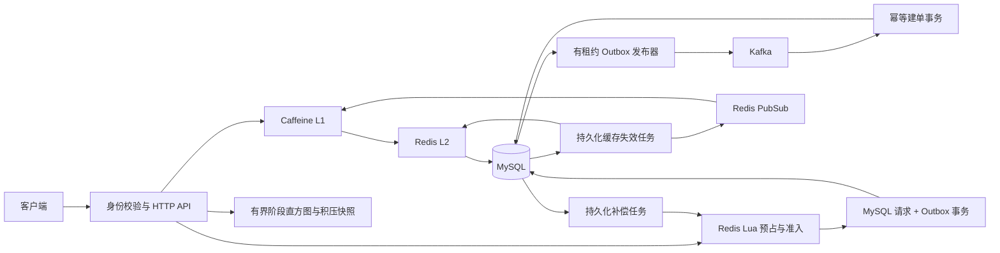
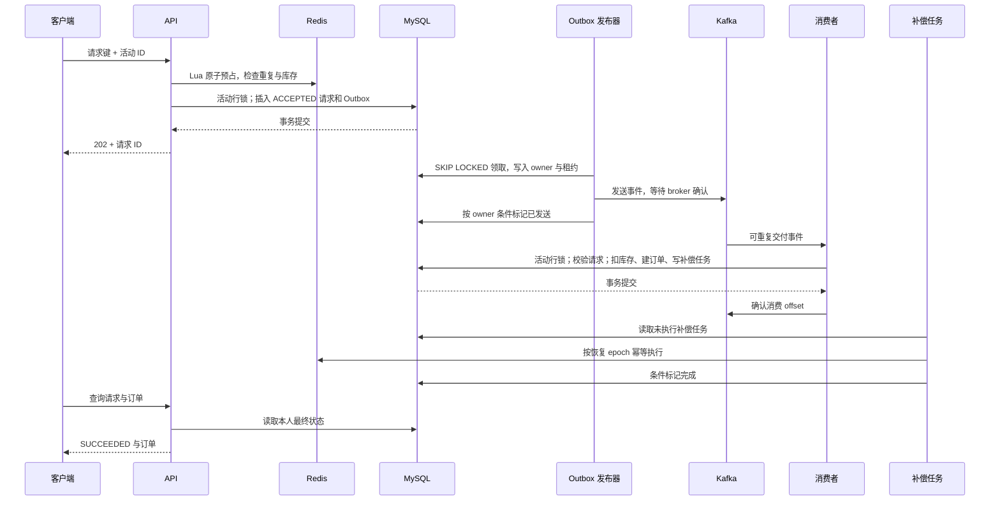

# 项目架构与面试讲解

本模块是黑马点评业务背景下的独立优化后端：重点是商家查询缓存和优惠券异步下单。接口以 `/v2` 开头，真实连接 MySQL、Redis、Kafka；本地确认不等于第三方支付。以下内容只描述已实现的机制，性能数据必须与对应 evidence 的代码版本和环境一起引用。

## 架构

缓存一致性依赖失效任务重试、L1 短 TTL、L2 硬截止时间共同约束。PubSub 提供及时通知，不承担可靠消息存储；重连时清空 L1。缓存查询允许受限降级，交易入口在 Redis 预占状态缺失时关闭新受理。

## 一次成功下单

202 表示请求已持久受理。请求 SUCCEEDED 表示已建单；订单仍可能处于待确认状态，随后确认、取消或超时。压测同时记录 HTTP 与最终建单两个完成时点，不能拿受理 QPS 冒充成功订单 TPS。

## 面试主线

**一分钟介绍**：我围绕黑马点评的商家缓存和优惠券秒杀做了独立后端改造。读链路使用 Caffeine、Redis、MySQL 多级缓存，加入有限陈旧、跨实例失效和 Redis 故障下的有界回源。写链路使用 Redis Lua 前置预占、MySQL 请求与 Outbox 同事务、Kafka 异步建单，以及持久化补偿和恢复 epoch。验证重点是库存守恒、重复消息幂等、进程崩溃后的收敛和完整成功订单吞吐。性能结论来自本机真实中间件实验，不把它包装成线上生产规模。

### 为什么采用多级缓存？

热点查询主要读取稳定商家资料，L1 可以省去 Redis 网络往返。选 Caffeine 是因为需要容量和时间约束、并发访问支持，而不是无限增长的 Map。L1 最长 1 秒，同时继承 Redis 数据的绝对硬截止时间，不能层层续期使旧值永久存活。Redis 负责共享缓存；数据库保留事实源。

空值缓存继续承担短时重复不存在查询的过滤。没有为了关键词加入布隆过滤器：当前数据规模和 ID 查询特征没有证明它的收益，新增布隆过滤器还需处理初始化、增量更新和误判。未来若实测大量不同非法 ID 穿透，再评估。

### Redis 故障时为什么不全部回源？

无限回源会把故障转移到数据库。商家读链路保留每实例 20 次/秒的回源预算及 4 个并发回源名额，超额快速失败；热 L1 在有效期内继续服务。秒杀新受理依赖预占一致性，故障时返回 503，已有订单查询仍走数据库。扩容实例会放大本地预算，因此这个限制不是全局配额。

### 为什么采用 Outbox？

数据库提交后直接发消息，存在提交成功但消息没发出的窗口。把请求和 Outbox 放在一个本地事务中，使发布器可重试未发送记录。Kafka 确认成功后、标记 sent_at 前崩溃会重复发送，所以仍必须实现消费幂等。生产者幂等配置不能替代业务幂等，也不能声称整条链路 exactly-once。

### 为什么不能只依赖 Redis 扣库存？

Redis 负责入口预占，MySQL 负责最终订单和库存约束。活动行锁统一串行化受理、建单、取消、过期和恢复；数据库用户/活动唯一约束兜住重复订单。代价是热点活动的关键修改串行化，因此需要实测其吞吐上限。不能凭一个慢 SQL 的总耗时断言全部时间都在等待行锁。

### 两个存储之间怎么恢复？

建单事务同步写补偿动作，后台任务以 epoch 和状态校验幂等修改 Redis。预占后、数据库落地前崩溃，由对账在活动行锁内裁定并写 EXPIRED 墓碑，防止迟到请求重新受理。Redis 状态丢失时先关闭受理，管理员从数据库恢复快照，再激活新 epoch；旧补偿不能污染新快照。目前自动恢复有单活动 10,000 条请求边界，超出时明确拒绝，不宣称大规模分片恢复已经完成。

### 有界发送窗口解决什么？

它允许少量 Kafka 发送 Future 同时在途，减少逐条等待网络确认造成的空闲，但不会消除 Outbox 数据库事务和消费端热点行锁。窗口限制为 1–8，不引入无界线程池。发送失败停止领取新记录，已领取记录通过确认、重试或租约到期恢复；消费仍然必须幂等。是否启用更大默认窗口由本轮对照数据决定。

### 怎么证明优化有效？

缓存实验固定数据、并发、用户和双实例配置，对直查数据库、Redis TTL、多级缓存各跑三轮。秒杀对照固定 HTTP 并发 8、每轮 500 个成功下单请求，分别只改变一个调度参数。持续流量按预定到达时间发出，记录生成器调度延迟、上限丢弃、积压和停止流量后的排空时间。阶段直方图 P95 是桶上界；SQL FOR UPDATE 计时包含连接、网络、执行和锁等待，另采样真实锁等待关系佐证。

## 简历素材

可直接使用的机制描述：

- 基于 Caffeine + Redis 构建多级商家缓存，设计绝对过期边界、持久化失效重试与跨实例通知，并通过限速及并发隔离保护 Redis 故障时的数据库回源。
- 设计 Redis Lua 预占、MySQL Outbox 与 Kafka 异步建单链路，通过数据库唯一约束、幂等消费、持久化补偿和恢复 epoch 保证重复消息及进程崩溃场景下的库存约束。
- 建立阶段耗时、队列积压、实际锁等待采样及故障注入验证，区分异步受理吞吐与最终成功建单吞吐，使用可复现实验选择参数。

有数据支撑的缓存表述：在 Apple M5、双 JVM、总并发 8 的本机合成热点查询实验中，多级缓存成功 QPS 中位数约 1.64 万，相比 Redis TTL 基线约 2.20 倍；P95 中位数从约 2.21 ms 降至 1.14 ms。必须保留“本机热点查询实验”这一限定，不能改写为生产全站 QPS。

本轮秒杀数据及最终推荐参数见 [链路观测与单变量优化报告](秒杀链路观测与单变量优化报告.md)。原缓存和前一轮故障原始证据见 [全链路验证与性能报告](本轮全链路验证与性能报告.md)。

## 后续热点事务优化

进一步保留活动行锁和状态约束，减少受理、建单锁内的重复结果回读，以及消费后的重复原因查询；使用 afterCompletion 记录查询获锁返回至事务完成的阶段时间。孤儿预占对账改为主键游标分页，并分别限制活动数和动作数。具体对照与 15 分钟验收证据见 [热点事务优化与长稳验收](热点事务优化与长稳验收.md)。不能把减少 SQL 次数直接写成相同比例的吞吐提升，性能结论以实测为准。

可核验的新表述：在独立本机环境，以每秒 40 次持续发压 15 分钟，36,000 次请求全部成功建单，业务完成时间近似 P95 为 116 ms；保留订单正常超时回补，并验证库存守恒。不要将其写成生产最大容量或 36,000 笔已确认成交。固定历史数据量对照中，精简查询的吞吐变化较小，可重点讲述定位方法和正确性取舍。
